## Hi there 👋

<div align="center">


</div>

<div align="center">
  
# 🌟 Product Alchemist | Turning Data Into Gold ✨


</div>

---


### 🚀 Quick Intro

```yaml
name: Sneha Deb Barma
located_in: Bengaluru, India
current_focus: Product Strategy & Data Analytics
superpower: Transforming chaos into clarity
fun_fact: I make dashboards people actually want to look at 📊
```

### ⚡ What I Do Best

🎯 **Product Thinking** - Solving problems users didn't know they had  
📊 **Data Storytelling** - Making numbers speak human  
🤖 **Smart Automation** - Why do manually what code can do better?  
🎨 **UX Obsession** - If it's not intuitive, it's not done  

<br clear="right"/>

---

<div align="center">

## 🎨 The Craft

<table>
<tr>
<td align="center" width="20%">

<br><strong>Python</strong>
</td>
<td align="center" width="20%">

<br><strong>SQL</strong>
</td>
<td align="center" width="20%">

<br><strong>JavaScript</strong>
</td>
<td align="center" width="20%">

<br><strong>Power BI</strong>
</td>
<td align="center" width="20%">

<br><strong>Jira</strong>
</td>
</tr>
</table>

</div>

---

<div align="center">

## 💥 Impact Highlights

</div>

<table>
<tr>
<td align="center" width="33%">

<br><sub>Crushed manual work with smart scripts</sub>
</td>
<td align="center" width="33%">

<br><sub>Built insights leaders actually use</sub>
</td>
<td align="center" width="33%">

<br><sub>Workflows that just work better</sub>
</td>
</tr>
</table>

---

<div align="center">

## 🎯 Currently Exploring

</div>

```diff
+ 🎨 Advanced UI/UX Design Patterns
+ 🤖 AI-Powered Product Features
+ 📊 Predictive Analytics for Product Decisions
+ 🧠 Behavioral Psychology in Product Design
```

---

<div align="center">

## 🔥 GitHub Activity


</div>

---

<div align="center">

## 🎪 Product Philosophy

<table>
<tr>
<td align="center">

### 🎯
**Ship Fast**  
Perfection is the  
enemy of good

</td>
<td align="center">

### 💡
**Stay Curious**  
Question everything,  
assume nothing

</td>
<td align="center">

### 📊
**Measure Twice**  
Data doesn't lie,  
feelings do

</td>
<td align="center">

### ❤️
**Empathy First**  
Build for humans,  
not just users

</td>
</tr>
</table>

</div>

---

<div align="center">

## 🌈 The Journey

```mermaid
graph LR
    A[Data Analyst] -->|Learned SQL & Python| B[Freelance Consultant]
    B -->|Built Dashboards| C[Product Manager]
    C -->|Currently| D[Building Amazing Products]
    D -->|Next| E[Your Team? 🚀]
    
    style A fill:#667EEA,stroke:#333,stroke-width:2px,color:#fff
    style B fill:#F59E0B,stroke:#333,stroke-width:2px,color:#fff
    style C fill:#10B981,stroke:#333,stroke-width:2px,color:#fff
    style D fill:#EC4899,stroke:#333,stroke-width:2px,color:#fff
    style E fill:#8B5CF6,stroke:#333,stroke-width:2px,color:#fff
```



</div>

---

<div align="center">

## 💬 Random Dev Quote


</div>

---

<div align="center">

## 🎵 Vibe Check

**Current Status:** Building products that don't suck 🚀  
**Coffee Consumed Today:** ☕☕☕☕  
**Favorite Debugging Method:** Rubber duck debugging 🦆  
**Dream Collaboration:** With YOU! Let's create something amazing  

</div>

---

<div align="center">

## 📬 Let's Connect & Create

<a href="https://linkedin.com/in/snehadebbarma">
  
</a>
<a href="mailto:snehadebbarma2@gmail.com">
  
</a>
<a href="https://github.com/snehadebbarma">
  
</a>

<br><br>


</div>

---

<div align="center">
<sub>🎨 This profile is crafted with code, coffee, and a dash of creativity</sub>
</div>
